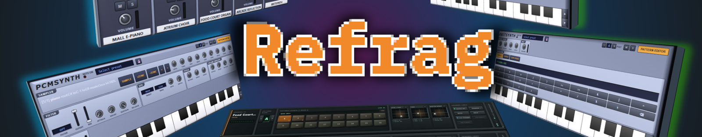

# Refrag - Web-based multi-user Music Studio


Refrag is a collaborative, rack-based virtual DAW inspired by Caustic 3.1. 

Sound is synthesized by a native C++ audio engine on the server and streamed to every
browser in a shared room. Machine controls, patterns, transport, mixer state,
effects, and automation are synchronized over WebSockets and persisted as room
snapshots.

This project is also a playground for **low-latency, multicore C++ optimization**:
Refrag uses a native synthesis engine with no dependencies on third party DSP 
libraries or toolkits.

## Quick start
Python 3.11 or newer is recommended.

```sh
python -m pip install -r requirements.txt
python -m pip install .
./start.sh
```

On Windows:

```bat
python -m pip install -r requirements.txt
python -m pip install .
start.bat
```

`python -m pip install .` builds and installs the native `refrag_engine` audio
extension, which the server requires. It needs a C++20 compiler (MSVC, Clang or
GCC); CMake and Ninja are fetched automatically. Rebuild it with the same
command after changing anything under `native/`.

Open `https://localhost:8000`. To choose a collaborative room, use
`https://localhost:8000/?room=your-room`. Share that URL with other musicians.
Set `REFRAG_PORT` before launching to use a port other than 8000.

Refrag always uses HTTPS. On first launch it creates a self-signed certificate
and key under `data/tls/`. Before opening Refrag, trust
`data/tls/refrag-cert.pem` on each computer, phone, or tablet; this is required
for browsers to enable microphone and AudioWorklet features without a security
warning. The public certificate can also be downloaded from
`https://<server-address>:8000/refrag-cert.pem` after initially accepting the
browser warning.

To replace the generated certificate with a trusted or CA-issued certificate,
set its PEM certificate and private-key paths:

```sh
export REFRAG_SSL_CERT=/path/to/cert.pem
export REFRAG_SSL_KEY=/path/to/key.pem
./start.sh
```

On Windows PowerShell:

```powershell
$env:REFRAG_SSL_CERT = "C:\path\to\cert.pem"
$env:REFRAG_SSL_KEY = "C:\path\to\key.pem"
.\start.bat
```

Both variables are required. If the server has additional DNS names or IP
addresses that automatic discovery misses, set a comma-separated
`REFRAG_SSL_HOSTS` value before the first launch, then delete `data/tls/` and
restart to regenerate the self-signed certificate.

## Architecture

- `server/app.py` serves the web app, room API, WebSocket, transport clock, and
  WAV export.
- `server/state.py` owns collaborative room state and JSON persistence.
- `native/` implements all 12 machine families, all 16 insert effects, mixer
  strips, sends, and the master chain in the `refrag_engine` C++ extension.
- `server/engine.py` orchestrates transport, sequencing, automation, and one
  native room-graph render call per block; `server/synth.py` manages the native
  binding and render-sample registration.
- `server/catalog.py` defines the controls exposed by all rack devices.
- `server/samples.py` procedurally generates the factory drum kit,
  instrument samples and vocoder loops.
- `web/` contains the dependency-free browser client.

Room files are written to `data/sessions/` as they change.
See `doc/user-guide.md` for the full manual.

## Tests

```sh
python -m unittest discover -s tests -v
python native/tests/test_native_engine.py
```
