# Refrag User's Guide

Refrag is a collaborative, web-based music studio. A rack of virtual
synthesizers, samplers and effects runs on a central server; every connected
browser sees the same rack, hears the same audio stream, and can tweak
anything live. This guide covers the whole application, from first launch to
exporting a finished song.

Contents:
[App Overview](#app-overview) ·
[Navigation](#navigation) ·
[Creating a Song](#creating-a-song) ·
[Automation](#automation) ·
[Song Export](#song-export) ·
[Machine Reference](#machine-reference) ·
[Effects Rack](#effects-rack) ·
[Mixer](#mixer) ·
[Master](#master) ·
[Sequencer](#sequencer) ·
[Live Performance Looper](#live-performance-looper) ·
[Machine Management](#machine-management) ·
[App Menu](#app-menu) ·
[Pattern Editor](#pattern-editor) ·
[Using your own samples](#using-your-own-samples) ·
[Collaboration](#collaboration)

---

## App Overview

Refrag models a rack-mount cabinet: sound machines are stacked into up to 14
dynamic slots, and five permanent devices — the effects rack, the mixer, the
master section, the sequencer and the live looper — sit below them. Every machine renders its
audio on the **server**; the mixed result is streamed to each browser over a
WebSocket as PCM audio, so everyone in a room hears exactly the same thing at
the same time.

Quick glossary:

- **Machine** – a device that produces or modifies sound. Up to 14 dynamic
  machines plus the five permanent devices.
- **Room** – a shared session. Everyone who opens the same room URL edits the
  same rack. Rooms auto-save to `data/sessions/`.
- **Pattern** – the basic building block of a song: up to 8 measures of notes
  stored in one of 64 slots (banks A–D × 16) per machine.
- **LFO** – low frequency oscillator; a control signal that wobbles a
  parameter (pitch, cutoff, volume…) at sub-audio rates.

### Getting started

```sh
python -m pip install -r requirements.txt
./start.sh            # start.bat on Windows
```

Open `https://localhost:8000` (or `https://localhost:8000/?room=my-band` to
pick a room). Click the **speaker button** in the control panel once — the
browser needs a user gesture before it may play audio.

Refrag generates `data/tls/refrag-cert.pem` and `refrag-key.pem` on first
launch and always serves HTTPS. Install and trust the public certificate on
each device before using Refrag; otherwise browsers may block AudioWorklet and
microphone access. You can download the public certificate from
`https://<server-address>:8000/refrag-cert.pem` after initially accepting the
browser warning.

To use a different certificate, set `REFRAG_SSL_CERT` and `REFRAG_SSL_KEY` to
its PEM certificate and private key before starting the server. For LAN names
or IPs missed by automatic discovery, set `REFRAG_SSL_HOSTS` before first
launch and delete `data/tls/` to regenerate the self-signed certificate.

---

## Navigation

There are three main parts to the interface: the **rack scrollbar**, the
**machine view** and the **control panel**.

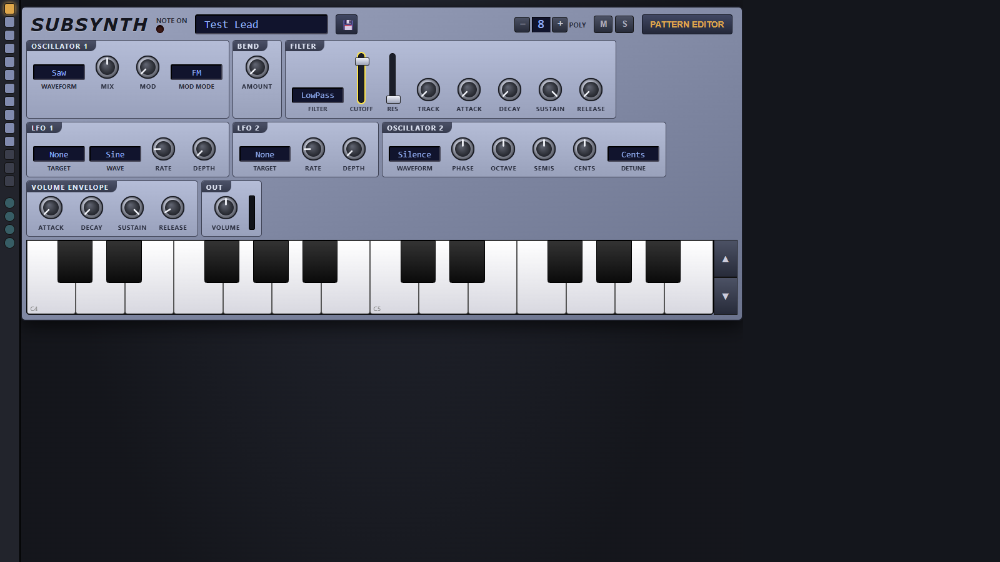

- The **rack scrollbar** (left edge) shows one dot per machine slot; the five
  round dots at the bottom are the permanent devices (Effects, Mixer, Master,
  Sequencer, Looper). Click a dot to jump to that device. Empty square dots open
  Machine Management so you can add a machine there.
- The **machine view** (center) shows the currently selected device.
- The **control panel** (bottom bar) is always visible:
  - **▦** opens [Machine Management](#machine-management).
  - **☰** opens the [App Menu](#app-menu).
  - The **LCD** shows the song name and the playback position in
    `measure.beat.sixteenth` form.
  - **PATTERN / SONG** toggles the playback mode. In *Pattern* mode every
    machine loops its currently selected pattern; in *Song* mode the
    sequencer timeline is played.
  - **👥** shows how many people are in the room.
  - **🔊** enables audio streaming in this browser tab.
  - **▶ / ■ / ●** are Play, Stop and Record. Pressing Stop while stopped
    rewinds to the loop start (if a loop is set) or to the beginning.
    Record arms live note and automation recording — a red outline flashes
    around the page while armed.

---

## Creating a Song

1. Open the App Menu and set the **tempo** with the +/− buttons (or tap the
   BPM display in rhythm).
2. Open **Machine Management** (▦) and add machines to slots.
3. Flip the control panel switch to **PATTERN**, press **Play**, then open a
   machine's **PATTERN EDITOR** and click notes into the grid — changes are
   heard immediately by everyone in the room while the pattern loops.
4. Add insert effects in the **Effects Rack** and balance levels in the
   **Mixer**.
5. Flip the switch to **SONG**, open the **Sequencer** and click pattern
   blocks into the timeline.
6. Arm **Record** and move knobs during playback to capture automation.
7. Export the result as a WAV file from the App Menu.

---

## Automation

Automation records knob movements so they play back automatically.

- **Pattern automation** is tied to one pattern (bank+number) of one machine
  and replays every time that pattern plays. To record it: select the
  pattern, make sure the mode switch says **PATTERN**, press **●**, press
  **▶** and move the knob. Values are stored on a 32nd-note grid.
- **Song automation** spans the whole song. Set the mode switch to **SONG**,
  arm record, play, and move knobs — values are stored as keyframes at the
  time they were touched and interpolated linearly on playback.

A **yellow** outline around a control means it has pattern automation; an
**orange** outline means song automation. While the song plays, automated
knobs move on screen for every user. To remove automation from a control,
right-click it and confirm.

---

## Song Export

Open the App Menu → **Song** tab:

- **Export WAV** renders the entire song offline on the server (44.1 kHz,
  16-bit stereo) with two extra seconds after the last note for effect tails,
  then downloads the file.
- **Export Loop** renders only the region between the loop cursors set in the
  sequencer timeline.

---

## Machine Reference

Every machine shares a common header: the **machine label** (click to
rename), a **NOTE ON LED**, the **preset LCD** (click to load a preset, 💾 to
save one — presets are stored per machine type in `data/presets/`),
**Mute/Solo** buttons linked to the mixer, and an editor toggle. Melodic
machines also have a **polyphony** selector and a two-octave preview keyboard.
BeatBox uses per-channel preview buttons instead; Sampler uses a sample preview
button and has neither a keyboard nor a polyphony selector.

### SubSynth


A virtual-analog subtractive synthesizer. Two oscillators (9 waveforms each,
Osc 2 adds a Silence option) are mixed, optionally cross-modulated (FM, PM or
AM with the **Mod** knob), passed through a resonant filter and shaped by a
volume envelope.

- **Oscillator 1**: waveform, Osc1/Osc2 **Mix**, **Mod** amount and mode.
- **Bend**: portamento time applied to each new note.
- **Oscillator 2**: waveform, phase offset, octave/semi/cent tuning, and a
  detune mode — *Cents* detunes Osc 2 only, *Unison* detunes both
  oscillators in opposite directions.
- **Filter**: type (LowPass/HighPass/BandPass and inverted variants that flip
  the envelope), cutoff and resonance sliders, keyboard tracking, and a full
  ADSR filter envelope.
- **LFO 1** (pitch/cutoff/volume/octave targets, 5 waveforms) and **LFO 2**.
- **Volume envelope** ADSR and output **Volume** with VU meter.

### PCMSynth

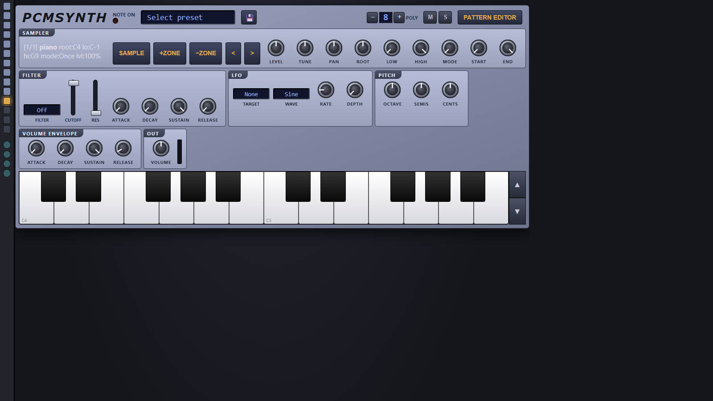

A sample player. Multiple sample **zones** map to keyboard ranges; each zone
has its own level, tune, pan, root key, low/high key, playback mode (Play
Once, Note On/Off, Loop Fwd, Loop Fwd-Back, and the Intro+Loop variants) and
loop start/end points. Zones use factory samples (piano, e-piano, strings,
choir, bass, flute…) or your own uploads — the **SAMPLE** and **+ZONE**
pickers include *Upload file* and *Record* actions (see
[Using your own samples](#using-your-own-samples)).
A classic synth section — filter with ADSR, LFO (pitch/cutoff/volume),
octave/semi/cent tuning and a volume ADSR — further shapes playback.

### Sampler

Sampler assigns one sound file to each pattern slot (A1 through D16). Open
**SAMPLE EDITOR** to choose a factory or uploaded sample, set the pattern to
1, 2, 4 or 8 measures, and edit it non-destructively. The waveform view has
draggable crop handles; excluded audio is shaded. **Normalize** analyzes the
selected crop and stores a safe per-pattern gain without rewriting the shared
WAV file.

Static controls set level, pitch, tone/brightness, distortion, and bass, mid,
and high gain. Four fixed-span ADSRs shape volume, tone, distortion, and pitch.
Attack and decay run from the start, sustain holds through the middle, and
release ends at the audible end. The tone, distortion, and pitch envelopes
also have signed depth controls.

Samples play at their natural speed. A short sample ends naturally; a long
sample stops at the pattern boundary and retriggers on the next loop. Sampler
patterns can be placed in the Song Sequencer or launched and queued in the
Live Performance Looper exactly like note patterns. Sampler presets save and
restore the complete 64-pattern sample bank, including crops, processing, and
envelopes. **IMPORT FILES...** uploads
multiple files in order and assigns them to consecutive slots of the current
16-pattern bank.

### BassLine

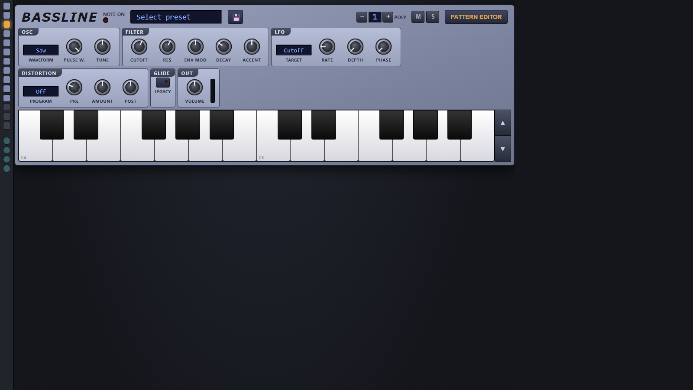

A monophonic acid-style lead. One oscillator (saw or square with adjustable
pulse width) runs into an envelope-modulated resonant low-pass filter with a
per-note decay. Notes can carry **accent** (adds volume and filter bite,
right-click a note in the editor) and **glide** (slides pitch without
retriggering, shift+right-click a note). The LFO targets pulse width, cutoff
or volume, and a built-in **distortion** unit offers Overdrive, Saturate,
Foldback and Fuzz programs with pre/amount/post gain.

### BeatBox

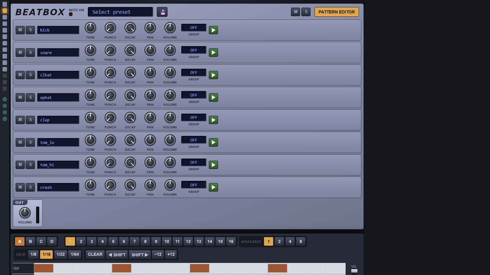

An 8-channel sample-based drum machine. Each channel has a sample LCD (click
to load any factory or uploaded sample), **Tune**, **Punch** (attack fade-in),
**Decay**, **Pan** and **Volume** knobs, channel Mute/Solo, a **mute group**
selector (channels in the same group choke each other — classic open/closed
hi-hat behaviour) and a preview button. Its pattern editor is a step grid:
one row per channel, one cell per 16th note.

### PadSynth

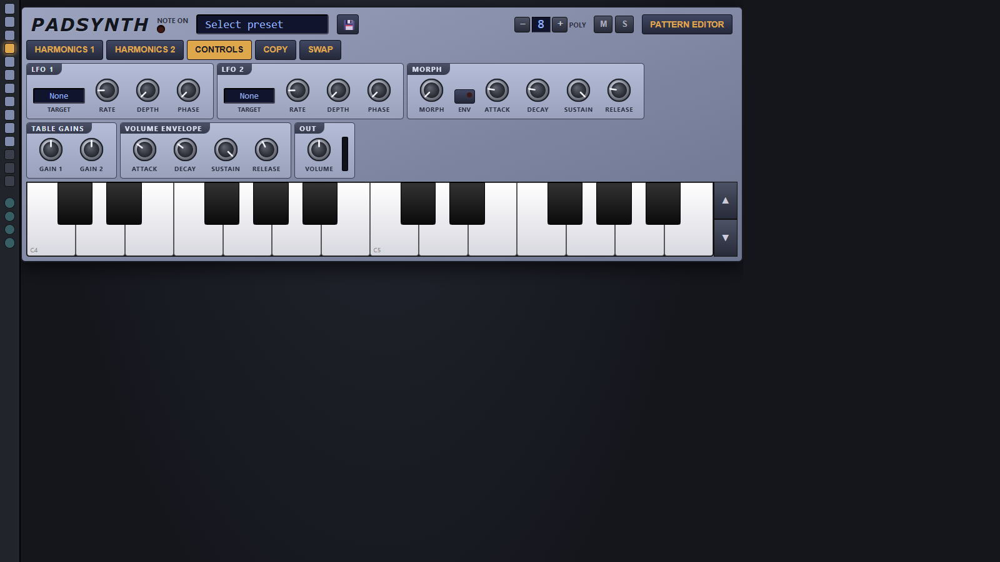
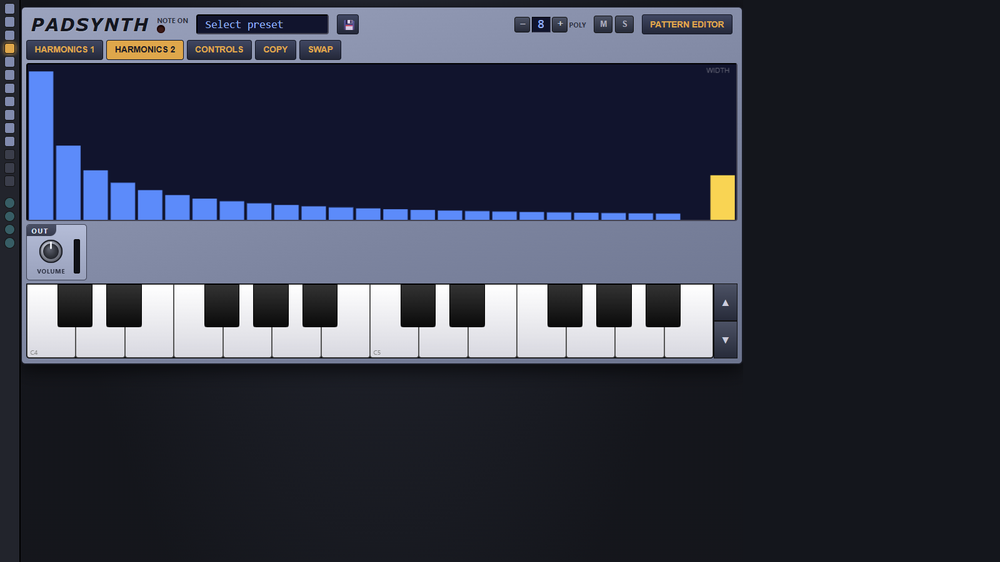

An additive pad machine based on the harmonic-smearing wavetable technique.
Draw the loudness of each harmonic in two tables (the yellow rightmost bar
sets the harmonic "width"/smear); the tables are rendered to long, evolving
wavetables that loop seamlessly. **Morph** blends the two tables — manually,
with its own ADSR envelope, or under LFO control. Two beat-synced LFOs target
pitch, morph or volume, each with a phase control, and separate gains plus a
volume ADSR complete the panel. **COPY** duplicates the other table into the
current one, and **SWAP** exchanges the two tables.

### 8BitSynth

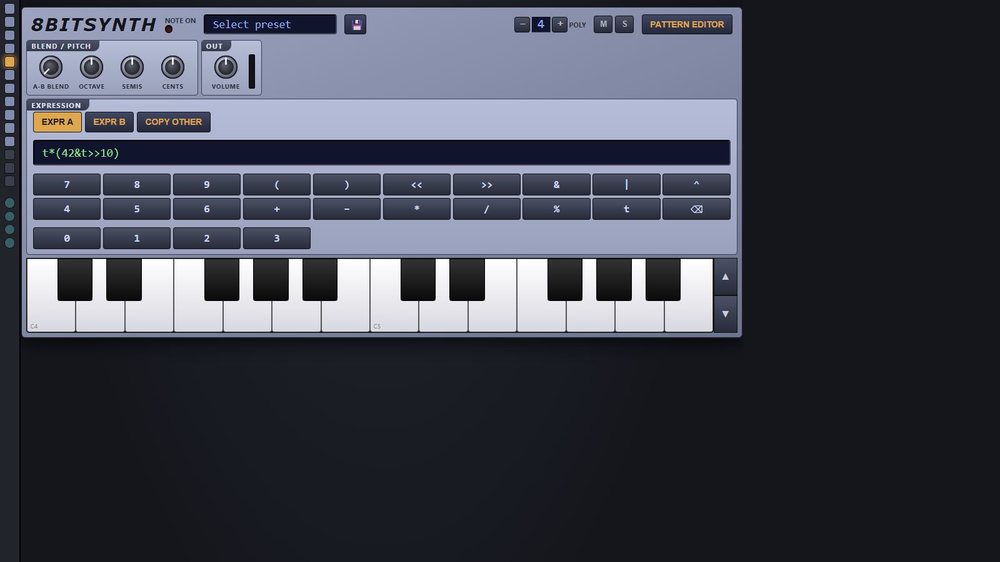

A bytebeat machine: a virtual 8-bit processor evaluates a mathematical
expression of the time variable `t` and plays the low byte of the result.
Two expressions (**A** and **B**) can be blended with the **A-B Blend**
knob. The programming keyboard offers digits, parentheses, `t`, and the
operators `+ − * / % & | ^ << >>`; results wrap at 256, producing gritty
chiptune, dubstep and glitch material. Octave/semi/cent knobs tune how fast
`t` advances with the note played. Expressions are validated on the server —
only arithmetic on `t` is allowed.

### Modular

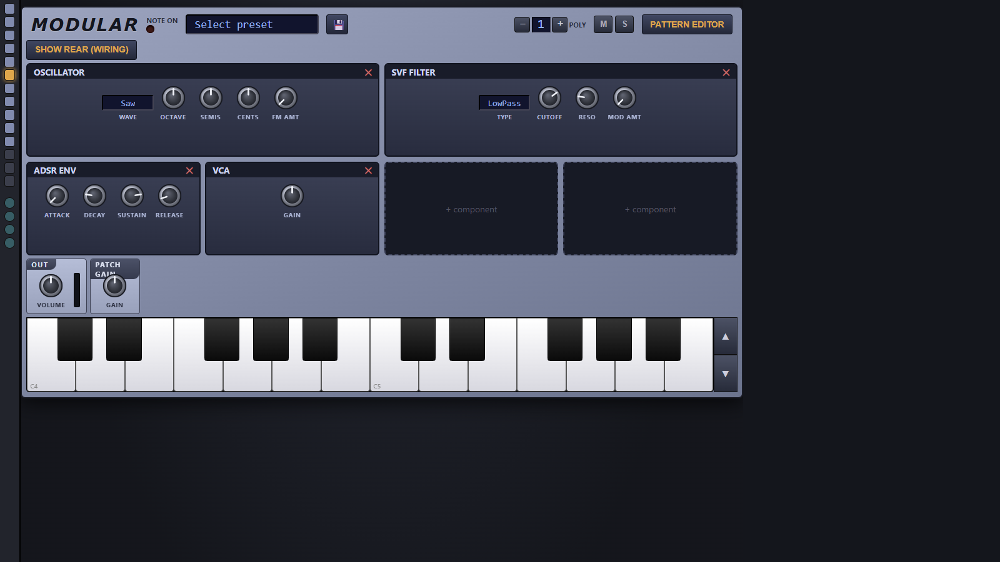
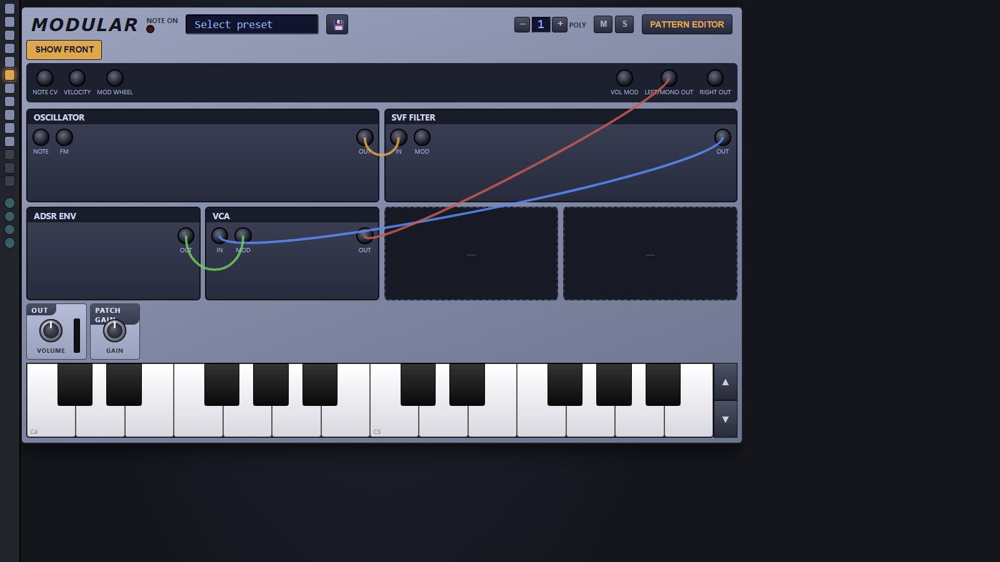

Build your own synth from components. The front view has 8 bays; click an
empty bay to choose from the component catalog (Oscillator, LFO, ADSR
Envelope, SVF Filter, VCA, 2-channel Mixer, Noise, Sample & Hold, Delay,
Waveshaper, Crossfader, Inverter — large components occupy two bays). Press
**SHOW REAR** to flip the rack around and patch signals: click an output
jack, then an input jack to run a wire; click a wired input to unplug it.
The fixed panel provides **Note CV**, **Velocity** and **Mod Wheel** outputs
plus **Volume Mod**, **Left/Mono Out** and **Right Out** inputs. The synth is
monophonic with last-note priority and supports glide notes.

### Organ

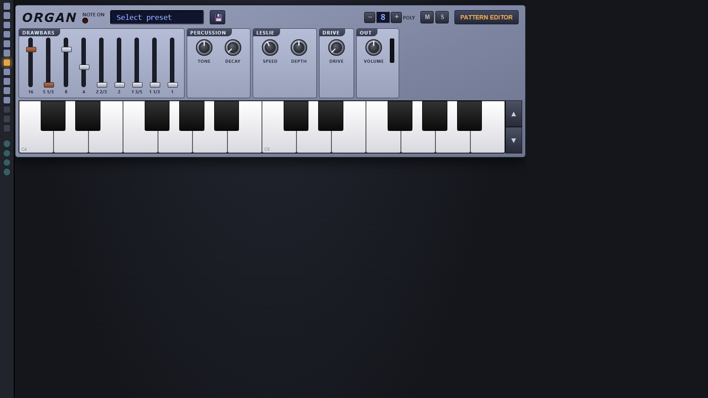

A drawbar organ with rotary-speaker simulation. Nine drawbars (16′ through
1′) set the level of each tonewheel harmonic. The **Percussion** section adds
a decaying attack transient whose **Tone** knob blends between the 4′ and
2 ⅔′ harmonics. The **Leslie** section modulates tremolo and stereo motion
with **Speed** and **Depth**, and **Drive** adds gentle overdrive.

### Vocoder

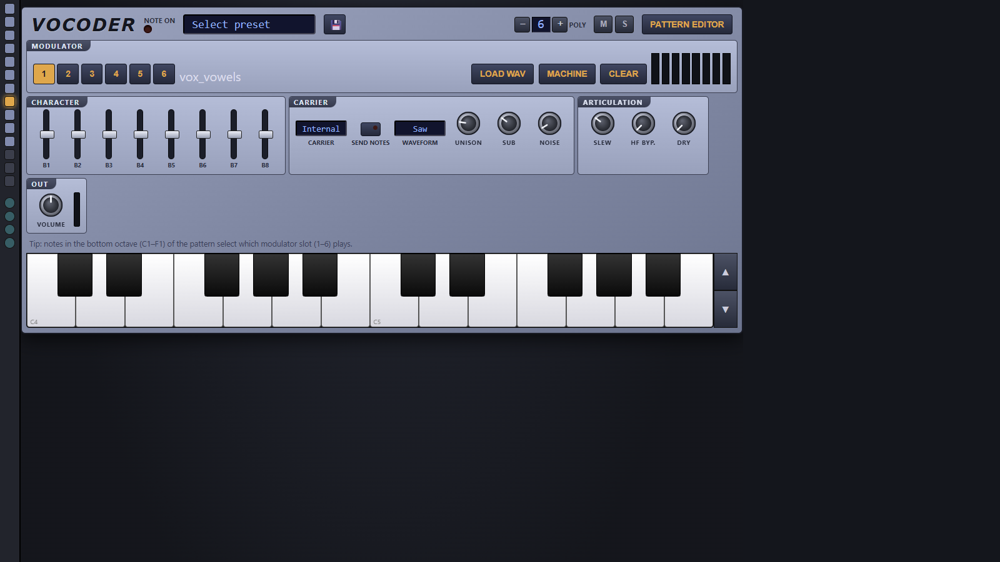

An 8-band vocoder. A **modulator** signal (speech-like factory loops such as
`vox_vowels`, a sample you upload or record from your phone via the **LOAD
WAV** picker, or the live output of any other machine in the
rack) is analyzed across 8 frequency bands; the measured band energies gate
the **carrier** — either the internal twin-oscillator synth (saw/square with
**Unison** detune, **Sub** oscillator and **Noise** mix) or any other
machine. Eight **character** sliders re-balance the bands, **Slew** limits
how fast articulation changes, **HF Bypass** passes high-frequency modulator
content for intelligibility, and **Dry** mixes in the raw modulator. Six
modulator slots are available; notes placed in the bottom octave (C1–F1) of
the vocoder's pattern select and restart modulator slots 1–6 during playback.

### FMSynth

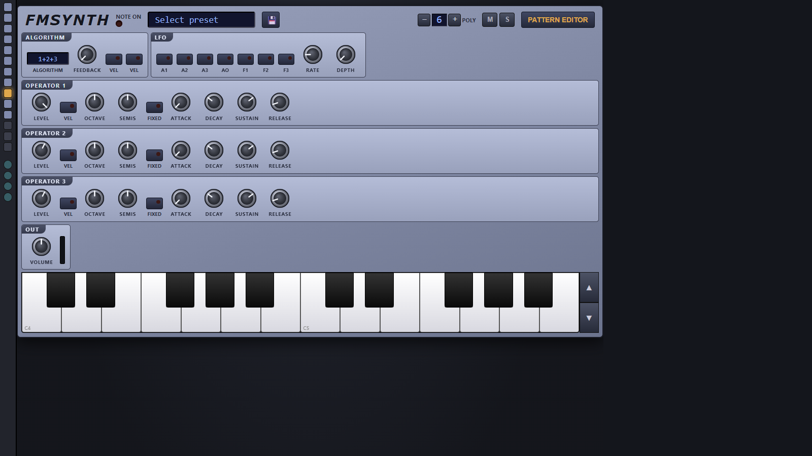

A 3-operator FM (phase-modulation) synth. The **Algorithm** selector chooses
one of five operator routings (chains, parallel modulators, or all three
straight to the output). Each operator has a level (with optional velocity
sensitivity), octave/semi tuning, a **Fixed** mode that ignores the keyboard,
and its own ADSR. Operator 3 offers **Feedback** self-modulation. The LFO can
simultaneously target any combination of the three operator amplitudes
(A1–A3), the output amplitude (AO) and the operator frequencies (F1–F3).

### KSSynth

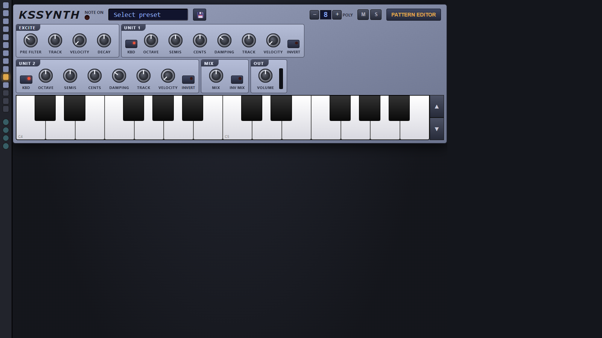

A plucked/struck string physical model with two independent string units.
The **Excite** section filters the excitation burst (Pre Filter with keyboard
tracking and velocity sensitivity) and sets the overall **Decay**. Each unit
has keyboard-follow, octave/semi/cent tuning, **Damping** (with tracking and
velocity), and an **Invert** switch for a softer, warmer pluck. **Mix**
balances the two units and **Inv Mix** flips their phase relationship.
Because the model is a tuned delay line, notes cannot be bent.

---

## Effects Rack

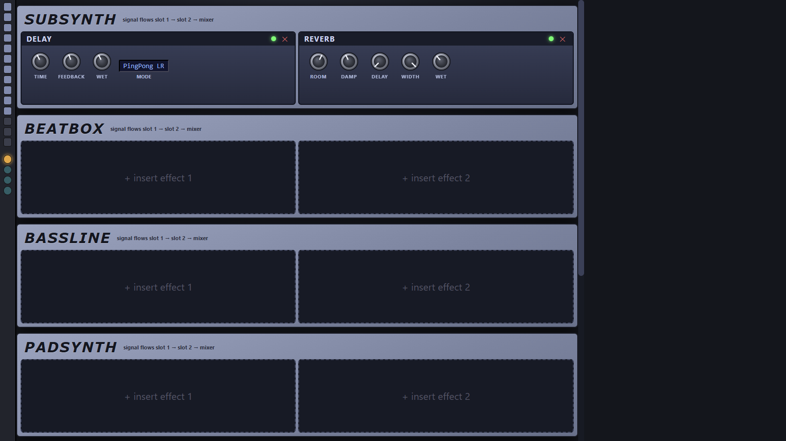

Each machine has **two insert slots**; the signal flows from slot 1 into
slot 2 and then into the machine's mixer strip. Click an empty slot to choose
an effect, click the effect's title bar to bypass/enable it (the green LED
shows it is active), and click ✕ to remove it. All 16 effects:

| Effect | Controls |
| --- | --- |
| **Distortion** | Program (Overdrive/Saturate/Fuzz/Foldback), Pre, Amount, Post |
| **BitCrusher** | Depth (1–16 bits), Rate, Jitter, Wet |
| **Compressor** | Threshold, Ratio, Attack, Release, SideChain (any mixer line) |
| **Flanger** | Depth, Rate, Feedback, Wet, waveform/stereo Mode |
| **Chorus** | Depth, Rate, Delay, Wet, waveform/stereo Mode |
| **Phaser** | Low, High, Depth, Rate, Feedback |
| **Auto-Wah** | Speed, Depth, Cutoff, Resonance, Wet |
| **Param EQ** | Freq, Gain, Bandwidth |
| **Limiter** | Pre, Attack, Release, Post |
| **Vinyl Sim** | Dust, Scratch, Noise, Age, Wet |
| **Comb Filter** | Freq, Reso, Wet |
| **Cabinet Sim** | Width, Height, Damp, Tone, Wet |
| **St. Flanger** | static Delay (± for L/R), Feedback, Wet, Mode |
| **Delay** | Time (BPM-synced), Feedback, Wet, Mode (mono/ping-pong/wide) |
| **Reverb** | Room, Damp, Delay, Width, Wet |
| **MultiFilter** | Type (8 filter shapes), Freq, Reso, Gain |

The Master section has two more insert slots of its own.

---

## Mixer

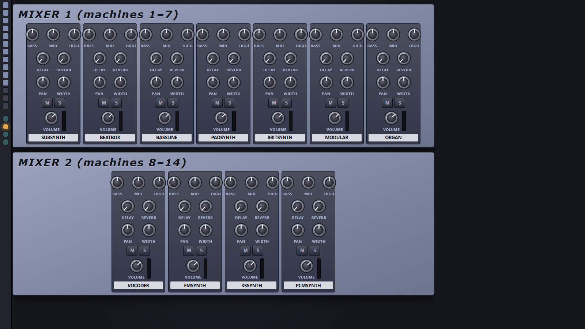

The mixer sums every machine into the final output. Strips 1–7 are on the
first mixer page, strips 8–14 on the second. Each strip provides:

1. **EQ knobs** (Bass / Mid / High) — cut or boost three bands.
2. **Send knobs** (Delay / Reverb) — how much post-fader signal feeds the
   global delay and reverb in the Master section.
3. **Stereo knobs** — **Pan** places the machine in the panorama; **Width**
   adds a small inter-ear delay toward the left or right for extra stereo
   size.
4. **Mute / Solo** — solo silences every non-soloed machine. These buttons
   mirror the ones on the machine panels.
5. **Volume knob and VU meter** — the strip's final level. If the VU reaches
   red the machine will clip in the mix.
6. **Strip label** — double-click to jump to that machine.

---

## Master

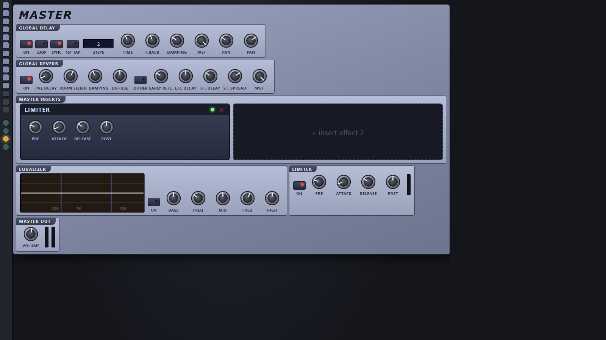

The master section holds the global effects and the final output chain:

- **Global Delay** — a multi-tap delay fed by the mixer's Delay sends.
  Controls: bypass, **Loop** (feeds the last tap back to the first), **Sync**
  (snaps Time to BPM divisions), **1st Tap** feedback, tap **Steps** count,
  **Time**, **F.Back**, high-frequency **Damping**, **Wet**, and a **Pan**
  knob for each alternating tap.
- **Global Reverb** — fed by the Reverb sends. Pre Delay, Room Size, HF
  Damping, Diffuse, Dither Echoes, Early Reflections level and decay, Stereo
  Delay, Stereo Spread, Wet, and bypass.
- **Master Inserts** — two effect slots applied to the summed mix (after the
  global delay and reverb are added).
- **Equalizer** — 3-band semi-parametric EQ with adjustable bass/mid
  crossover frequencies and a response-curve display.
- **Limiter** — Pre gain, Attack, Release, Post gain, a gain-reduction meter
  and bypass.
- **Master Out** — final volume with stereo VU meters.

---

## Sequencer

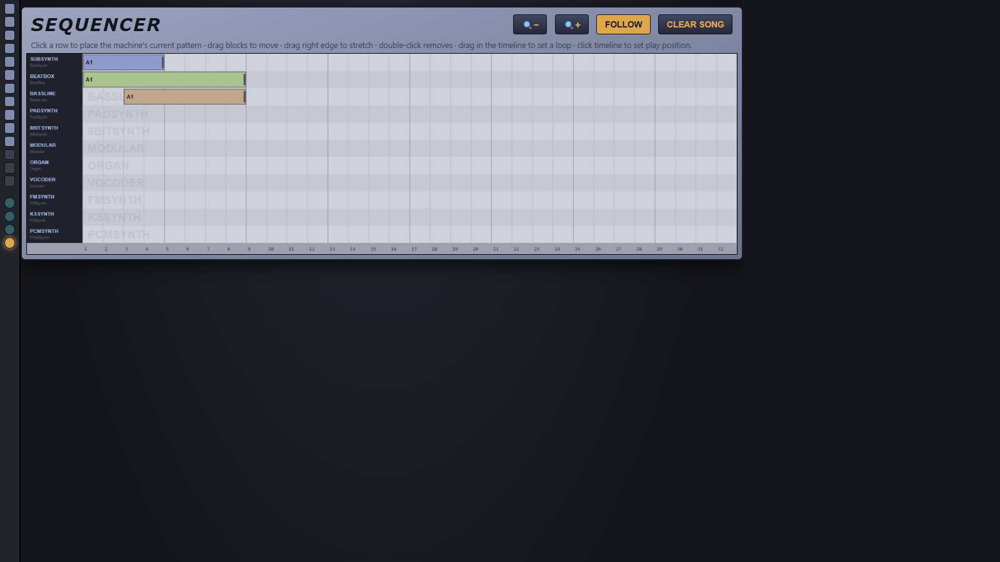

Switch the control panel to **SONG** mode to hear the sequencer. Each row is
one machine; columns are measures.

- **Click** an empty cell to place a pattern — a popup asks which bank and
  pattern to trigger (slots that contain notes are highlighted green).
- **Drag** a block to move it; **drag its right edge** to stretch it — the
  pattern repeats to fill the stretched block.
- **Double-click** a block to remove it.
- **Timeline**: click to set the playback position; drag across measures to
  set **loop cursors** (drag them to nothing to clear the loop). The loop
  region also defines what *Export Loop* renders.
- **🔍 + / −** change the zoom, **FOLLOW** keeps the view on the playhead,
  and clicking a machine's name in the left column jumps to that machine.

---

## Live Performance Looper

The **Looper** is the last permanent rack device, immediately after the
Sequencer. It provides one physical-style performance row for every installed
machine.

- Use the **< / > bank buttons** to browse banks A-D. Browsing does not change
  the sound; press one of the 16 square pattern pads to launch it.
- While stopped, a pressed pattern becomes active immediately. During Pattern
  playback, each pad press appends to that machine's launch queue and starts on
  pattern boundaries. Press the same pad multiple times to queue repeats.
- Pattern lengths are independent, so a one-measure drum pattern can switch
  before an eight-measure pad pattern. Filled pads have a note indicator, but
  for Sampler a pad is filled when it has an assigned sample. Empty patterns
  are also launchable and can be used as a deliberate silent cycle.
- **CLR** cancels the entire queued launch list for that machine.
- Each machine row has **QUEUE MODE** and **RANDOM MODE**:
  - **Queue** plays exactly what you queue.
  - **Random** picks the next pattern from non-empty patterns in the currently
    browsed bank whenever the queue is empty.
- Selecting a pattern from the Looper while the transport is in Song mode
  switches the room to Pattern mode and launches the selection immediately.
  Stopping playback clears every pending queue.
- **Flourish** enables or disables generated flourish notes for the live
  pattern. The switch is unavailable when that pattern has no flourish.
- The three 2D pads control **pan/volume**, **bass/treble EQ**, and
  **delay/reverb sends**. Drag in both axes at once; **RST** returns both
  parameters to their defaults.
- **Mute**, **Solo**, and the two **FX** switches control channel logic and
  insert bypass. An empty insert is shown as unavailable.
- **Transpose Sequencer** replaces one-shot transpose buttons with 4 looping
  steps per machine row. Each step has:
  - a transpose amount (-24 to +24 semitones), and
  - a loop duration (1-4 pattern loops).
  Steps advance on that machine's pattern boundaries and wrap continuously.
  BeatBox uses fixed drum mappings and Sampler uses per-pattern pitch controls,
  so neither machine is transposed here.

Looper actions, mixer changes, active/queued pads, and launch timing are shared
with everyone connected to the room.

---

## Machine Management

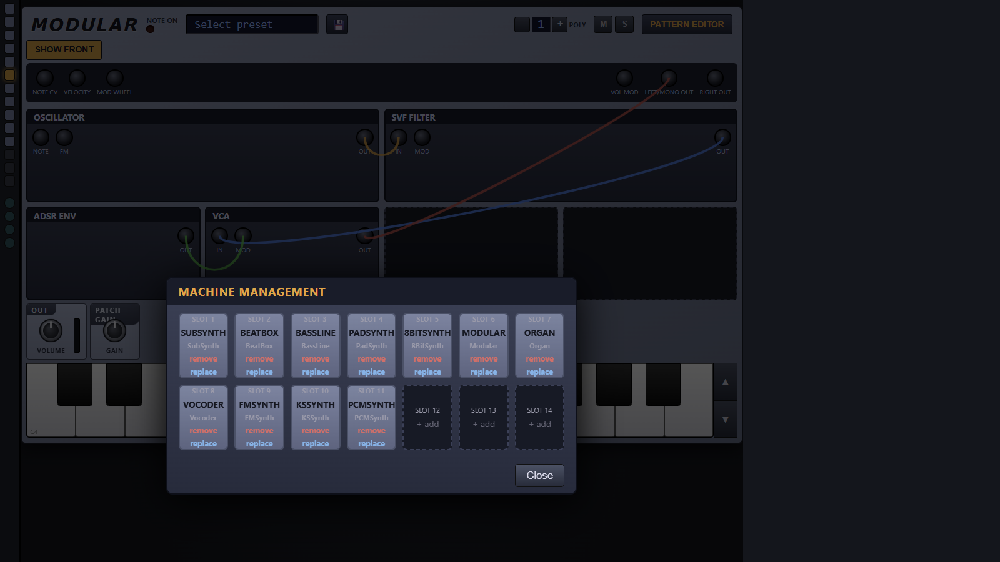

Open with the ▦ button. Click a filled slot to jump to that machine, **+
add** to put a new machine in an empty slot, **replace** to change a
machine's type while keeping its patterns, mixer strip and insert effects
(control automation is dropped since knobs don't map across types), and
**remove** to delete a machine along with its patterns and song blocks.

---

## App Menu

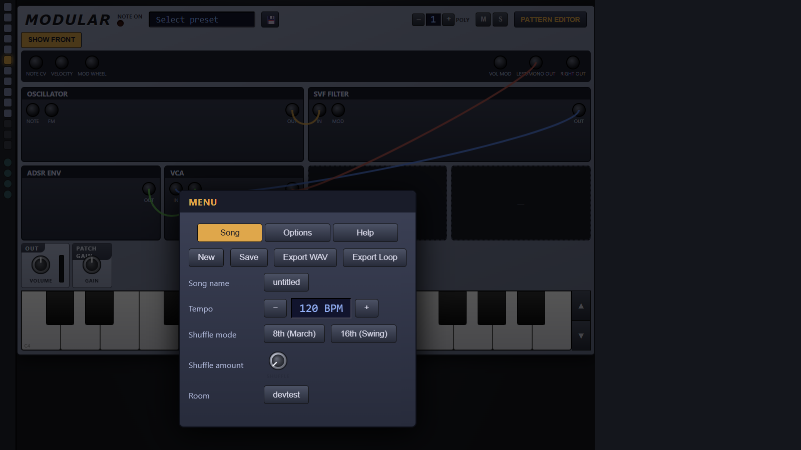

- **Song tab** — *New* (clears the rack after confirmation), *Save* (forces a
  room snapshot to disk; rooms also auto-save a couple of seconds after any
  change), *Export WAV*, *Export Loop*, the song name, **Tempo** (with tap
  tempo on the BPM display), global **shuffle** mode (8th "March" or 16th
  "Swing") and amount, and the **room** switcher.
- **Options tab** — enable the audio stream, choose the shared engine
  **sample rate** and **block size** (with a latency estimate), upload
  audio files or record samples from the microphone (see
  [Using your own samples](#using-your-own-samples)), and configure
  **MIDI keyboard input** (see below). The control-panel **XRUN** marker
  shows cumulative render deadline misses for the room.
- **Help tab** — quick pointers and a link to this guide.

### MIDI keyboard input

Plug a USB MIDI keyboard into your computer or mobile device (Android
supports USB/OTG MIDI keyboards; iOS Safari does not support Web MIDI).
In the App Menu → **Options tab**, under **MIDI keyboard input**:

- **Enable MIDI input** — turns on the browser's Web MIDI access. The
  browser will prompt for permission the first time.
- **Input device** — pick a specific connected keyboard, or "All devices"
  to accept input from every connected MIDI controller.
- **MIDI channel** — filter to a single MIDI channel, or "All channels".
- **Rescan devices** — refresh the device list if you plug something in
  after opening the settings.

Once enabled, playing notes on the MIDI keyboard controls whichever
machine panel is currently open, exactly like clicking the on-screen
keyboard — other people in the room see the same note-on indicator and
keyboard highlight. This is a per-browser/device preference (not part of
the shared room state), so each collaborator configures their own MIDI
setup independently.

---

## Pattern Editor

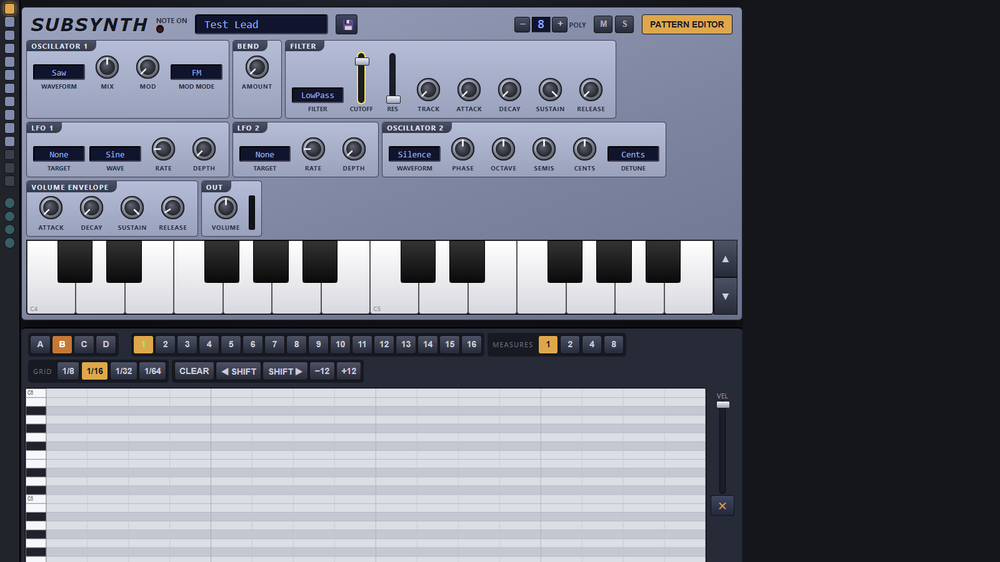

Most machines use the note editor opened with the **PATTERN EDITOR** button.
It edits the machine's *current* pattern live — during playback, added and
moved notes take effect on the next pass of the loop, for every listener in
the room.

- **Bank (A–D) and pattern (1–16) buttons** select the active pattern slot;
  green numbers already contain notes. Right-click a pattern button for
  options: copy the pattern to another slot, clear it, or transpose it.
- **Measures** grows or shrinks the pattern (1, 2, 4 or 8 measures).
- **Grid** selects the snap/note size from 8th to 64th notes.
- **Piano roll**: click an empty cell to add a note (its length equals the
  grid size), drag a note to move it, drag its right end to resize, and
  double-click to delete. Right-click toggles **accent**; shift+right-click
  toggles **glide** (machines with polyphony 1 slide between glide notes
  without retriggering).
- The **side keyboard** previews notes and drags up/down to scroll octaves.
- The **velocity slider** on the right sets the velocity of new notes and
  adjusts the selected note; note opacity reflects velocity.
- **CLEAR / SHIFT / ±12** operate on the whole pattern: erase it, rotate it
  in time by a 16th, or transpose it by an octave.
- The BeatBox editor is a **drum grid** instead: one row per channel, one
  click per 16th step to toggle a hit.
- Sampler opens the dedicated **SAMPLE EDITOR** described in the machine
  reference. Its green pattern numbers indicate assigned samples rather than
  notes, and it has no piano roll, live note recording, Flourish, or AI Match.

### Live recording

Arm **●** while playing in pattern mode and play the preview keyboard: notes
are quantized to 16ths and written into the current pattern as you play.
Recorded knob movements become automation (see [Automation](#automation)).

### Flourish

**✦ FLOURISH** expands the current pattern with generated notes — chords,
runs, pads or fills built around the notes you already placed. Pick one or
more themes in the dialog and press **Generate**:

- **Major / Minor / Jazzy** control the harmony: chord tones are stacked on
  your notes in the best-fitting key (Jazzy adds 7th/9th color tones).
- **Fast / Mellow / Syncopated** control the rhythm: scalewise runs between
  your notes, sustained low pads, or short off-beat stabs.
- **Arp / Octaves** control the texture: chords are staggered into
  arpeggios, or notes are doubled an octave up or down.

Flourish only ever *adds* notes — it never removes, moves or resizes yours,
and it never changes the pattern's measure count. Added notes glow **blue**
in the editor. Press **Reroll** for a different take on the same themes, or
**Remove all** to drop every flourish note. The **FL ON/OFF** toolbar button
toggles whether flourish notes play — they stay visible (dimmed) while off.
Click a blue note to *commit* it: it becomes a normal pattern note that
survives rerolls and removal. In the BeatBox drum grid the same themes
translate to hat beds, ghost snares, off-beat kicks and tom fills.

### AI Match

**AI MATCH** fills the current pattern from a sound clip. Record up to 15
seconds from the microphone or pick an audio file (M4A/AAC, MP3, OGG, WAV —
decoded locally in the browser), preview it, and press **MATCH**. The server
transcribes the clip with a small neural network (Spotify's Basic Pitch
model, downloaded automatically on first use) and writes the notes and
chords it hears into the pattern, quantized to 16ths at the room tempo.

AI Match **replaces the whole pattern** and may change its measure count
(1–8 measures, fitted to the clip length), but it never touches the
machine's instrument settings. On a BeatBox it instead detects drum hits
and maps them onto the kit channels (kick, snare, hats, …) by their sound.
As with recording samples, microphone capture requires HTTPS or
`localhost`; file upload works everywhere.

---

## Using your own samples

The PCMSynth, Sampler, BeatBox and Vocoder all open the same **sample picker**
(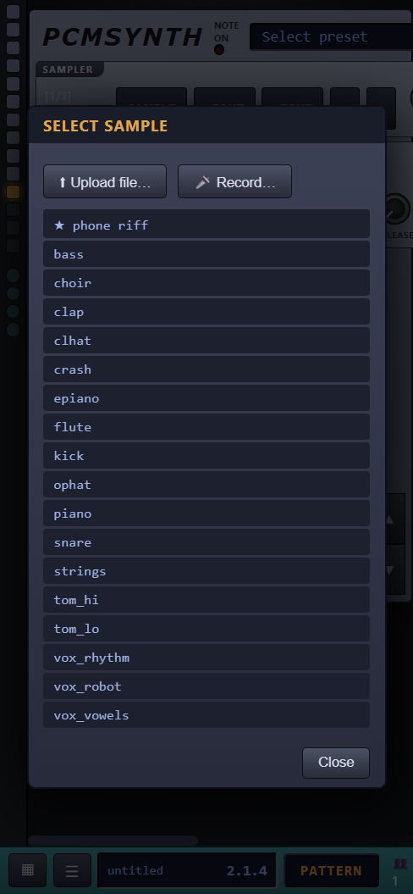) whenever you choose a
sample. Besides the factory library and your previous uploads (marked ★), the
picker offers two actions that work from a phone as well as a desktop:

- **⬆ Upload file…** — choose any audio file on your device. Phone
  recordings in M4A/AAC, MP3, OGG or WAV are all accepted: the browser
  decodes the file locally, downmixes it to mono, converts it to 16-bit WAV
  and uploads it (up to 64 MB). On iOS/Android the file chooser lets you pick
  from Voice Memos, Files, or your music library. After the upload finishes,
  the sample is selected automatically and is available to every user in the
  room.
- **🎤 Record…** — capture up to 30 seconds from the device microphone,
  name it, and it is uploaded the same way. Browsers only allow microphone
  access on secure origins, so recording requires HTTPS or `localhost`; over
  a plain-HTTP LAN address use *Upload file* with a voice-memo recording
  instead.

Uploaded samples are stored on the server in `data/samples/` and appear in
all sample pickers: PCMSynth zones (**SAMPLE** / **+ZONE**), Sampler pattern
slots, BeatBox channel LCDs, and the Vocoder's **LOAD WAV** modulator button.
The same actions are also available from the App Menu → Options tab.

---

## Collaboration

Every browser pointing at the same `?room=` URL shares one rack:

- All edits — machines, knobs, notes, song blocks, transport — are broadcast
  instantly to every participant.
- Audio is rendered once on the server and streamed to everyone, so all
  listeners hear an identical, synchronized mix (with roughly 100–300 ms of
  network buffering).
- Preview-keyboard presses from other users light up on your screen.
- Rooms persist on the server; reopening a room URL restores the whole
  session, including patterns, effects and automation.
